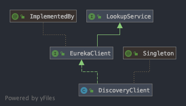

查看测试类link:eureka-server/src/test/java/com/netflix/eureka/resources/EurekaClientServerRestIntegrationTest.java[EurekaClientServerRestIntegrationTest]的``startServer()``方法可以发现，Eureka Server实际上就是个Servlet，默认使用``jersey``启动，下面是测试使用的``web.xml``文件：

.web.xml
[xml]
----
<?xml version="1.0" encoding="UTF-8"?>
<web-app version="2.5"
        xmlns="http://java.sun.com/xml/ns/javaee"
        xmlns:xsi="http://www.w3.org/2001/XMLSchema-instance"
        xsi:schemaLocation="http://java.sun.com/xml/ns/javaee
    http://java.sun.com/xml/ns/javaee/web-app_2_5.xsd">
<listener>
    <listener-class>com.netflix.eureka.EurekaBootStrap</listener-class>
</listener>

<filter>
    <filter-name>statusFilter</filter-name>
    <filter-class>com.netflix.eureka.StatusFilter</filter-class>
</filter>

<filter>
    <filter-name>requestAuthFilter</filter-name>
    <filter-class>com.netflix.eureka.ServerRequestAuthFilter</filter-class>
</filter>
<filter>
    <filter-name>rateLimitingFilter</filter-name>
    <filter-class>com.netflix.eureka.RateLimitingFilter</filter-class>
</filter>
<filter>
    <filter-name>gzipEncodingEnforcingFilter</filter-name>
    <filter-class>com.netflix.eureka.GzipEncodingEnforcingFilter</filter-class>
</filter>

<filter>
    <filter-name>jersey</filter-name>
    <filter-class>com.sun.jersey.spi.container.servlet.ServletContainer</filter-class>
    <init-param>
    <param-name>com.sun.jersey.config.property.WebPageContentRegex</param-name>
    <param-value>/(flex|images|js|css|jsp)/.*</param-value>
    </init-param>
    <init-param>
    <param-name>com.sun.jersey.config.property.packages</param-name>
    <param-value>com.sun.jersey;com.netflix</param-value>
    </init-param>

    <!-- GZIP content encoding/decoding -->
    <init-param>
    <param-name>com.sun.jersey.spi.container.ContainerRequestFilters</param-name>
    <param-value>com.sun.jersey.api.container.filter.GZIPContentEncodingFilter</param-value>
    </init-param>
    <init-param>
    <param-name>com.sun.jersey.spi.container.ContainerResponseFilters</param-name>
    <param-value>com.sun.jersey.api.container.filter.GZIPContentEncodingFilter</param-value>
    </init-param>
</filter>

<filter-mapping>
    <filter-name>statusFilter</filter-name>
    <url-pattern>/*</url-pattern>
</filter-mapping>

<filter-mapping>
    <filter-name>requestAuthFilter</filter-name>
    <url-pattern>/*</url-pattern>
</filter-mapping>

<!-- Uncomment this to enable rate limiter filter.
<filter-mapping>
    <filter-name>rateLimitingFilter</filter-name>
    <url-pattern>/v2/apps</url-pattern>
    <url-pattern>/v2/apps/*</url-pattern>
</filter-mapping>
-->

<filter-mapping>
    <filter-name>gzipEncodingEnforcingFilter</filter-name>
    <url-pattern>/v2/apps</url-pattern>
    <url-pattern>/v2/apps/*</url-pattern>
</filter-mapping>

<filter-mapping>
    <filter-name>jersey</filter-name>
    <url-pattern>/*</url-pattern>
</filter-mapping>

<welcome-file-list>
    <welcome-file>jsp/status.jsp</welcome-file>
</welcome-file-list>

</web-app>
----

其中比较关键的是：
[xml]
----
<listener>
    <listener-class>com.netflix.eureka.EurekaBootStrap</listener-class>
</listener>
----

``EurekaBootStrap``类实现了``ServletContextListener``接口，在启动时会执行``contextInitialized()``方法，Eureka Server的启动过程都实现在该方法中，该方法代码：
[java]
----
@Override
public void contextInitialized(ServletContextEvent event) {
    try {
        // 初始化eureka.datacenter属性和eureka.environment属性属性
        initEurekaEnvironment();
        // 初始化各种组件，创建定时任务
        initEurekaServerContext();

        ServletContext sc = event.getServletContext();
        sc.setAttribute(EurekaServerContext.class.getName(), serverContext);
    } catch (Throwable e) {
        logger.error("Cannot bootstrap eureka server :", e);
        throw new RuntimeException("Cannot bootstrap eureka server :", e);
    }
}
----

首先调用的是``initEurekaEnvironment()``方法：
[java]
----
protected void initEurekaEnvironment() throws Exception {
    logger.info("Setting the eureka configuration..");

    // 获取eureka.datacenter属性，如果值为cloud则eureka server会认为其运行在aws环境中
    String dataCenter = ConfigurationManager.getConfigInstance().getString(EUREKA_DATACENTER);
    if (dataCenter == null) {
        logger.info("Eureka data center value eureka.datacenter is not set, defaulting to default");
        // 如果没有设置eureka.datacenter属性，则使用default值，并保存到archaius.deployment.datacenter环境变量中
        ConfigurationManager.getConfigInstance().setProperty(ARCHAIUS_DEPLOYMENT_DATACENTER, DEFAULT);
    } else {
        ConfigurationManager.getConfigInstance().setProperty(ARCHAIUS_DEPLOYMENT_DATACENTER, dataCenter);
    }
    // 获取eureka.environment属性
    String environment = ConfigurationManager.getConfigInstance().getString(EUREKA_ENVIRONMENT);
    if (environment == null) {
        // 默认设置为test，并保存到archaius.deployment.environment属性中
        ConfigurationManager.getConfigInstance().setProperty(ARCHAIUS_DEPLOYMENT_ENVIRONMENT, TEST);
        logger.info("Eureka environment value eureka.environment is not set, defaulting to test");
    }
}
----

``initEurekaEnvironment()``方法读取``eureka.datacenter``和``eureka.environment``属性。默认分别初始化为default和test

下面再看看``initEurekaServerContext()``方法：
[java]
----
protected void initEurekaServerContext() throws Exception {
    // DefaultEurekaServerConfig表示当前eureka server的配置，其构造函数从classpath中获取eureka-server.properties文件和
    // eureka-server-test.properties文件并将配置保存到ConfigurationManager的instance属性中
    // DefaultEurekaServerConfig类也为大部分属性提供了默认值
    EurekaServerConfig eurekaServerConfig = new DefaultEurekaServerConfig();

    // For backward compatibility
    // 初始化序列化和反序列化工具类
    JsonXStream.getInstance().registerConverter(new V1AwareInstanceInfoConverter(), XStream.PRIORITY_VERY_HIGH);
    XmlXStream.getInstance().registerConverter(new V1AwareInstanceInfoConverter(), XStream.PRIORITY_VERY_HIGH);

    logger.info("Initializing the eureka client...");
    logger.info(eurekaServerConfig.getJsonCodecName());
    // ServerCodecs用于获取编码和解码工具类，可以将对象编码为字符串或输出到流
    ServerCodecs serverCodecs = new DefaultServerCodecs(eurekaServerConfig);

    ApplicationInfoManager applicationInfoManager = null;

    // eurekaClient默认为null
    if (eurekaClient == null) {
        // isCloud方法判断archaius.deployment.datacenter属性的值是否等于cloud，默认为false
        // 所以默认EurekaInstanceConfig的实现为MyDataCenterInstanceConfig。MyDataCenterInstanceConfig表示当前的eureka server
        // 不是运行在一个云环境
        // EurekaInstanceConfig接口定义了被注册到eureka server的实例应该提供的配置信息，MyDataCenterInstanceConfig类继承自
        // PropertiesInstanceConfig类，PropertiesInstanceConfig类实现了EurekaInstanceConfig接口的大部分方法，提供了大部分属性的
        // 默认值，同时PropertiesInstanceConfig类的构造函数默认会获取eureka-client.properties文件的配置并保存到ConfigurationManager
        // 的instance属性中
        EurekaInstanceConfig instanceConfig = isCloud(ConfigurationManager.getDeploymentContext())
                ? new CloudInstanceConfig()
                : new MyDataCenterInstanceConfig();

        // EurekaConfigBasedInstanceInfoProvider类实现了Provider<InstanceInfo>，能够获取InstanceInfo对象，InstanceInfo
        // 对象表示一个注册到了eureka server的实例的信息和配置，主要包括instanceId、address、心跳状态和配置等，具体的可以看
        // EurekaConfigBasedInstanceInfoProvider类的get方法的实现
        // ApplicationInfoManager对象持有EurekaInstanceConfig和EurekaConfigBasedInstanceInfoProvider对象，能够表示一个
        // 实例的信息，通过ApplicationInfoManager对象可以修改实例的信息，同时还支持添加StatusChangeListener
        applicationInfoManager = new ApplicationInfoManager(
                instanceConfig, new EurekaConfigBasedInstanceInfoProvider(instanceConfig).get());
            
        // EurekaClientConfig接口定义了一个eureka client需要提供的配置信息，这些信息决定了如何和eureka server交互，
        // DefaultEurekaClientConfig对象根据eureka-client.properties文件的内容返回这些配置信息，并为大部分配置提供了默认值
        EurekaClientConfig eurekaClientConfig = new DefaultEurekaClientConfig();
        // DiscoveryClient对象可以说是最重要的对象了，该对象能够获取到eureka server上的实例信息，通过开启了心跳和拉取实例信息的定时任务
        eurekaClient = new DiscoveryClient(applicationInfoManager, eurekaClientConfig);
    } else {
        applicationInfoManager = eurekaClient.getApplicationInfoManager();
    }

    PeerAwareInstanceRegistry registry;
    if (isAws(applicationInfoManager.getInfo())) {
        registry = new AwsInstanceRegistry(
                eurekaServerConfig,
                eurekaClient.getEurekaClientConfig(),
                serverCodecs,
                eurekaClient
        );
        awsBinder = new AwsBinderDelegate(eurekaServerConfig, eurekaClient.getEurekaClientConfig(), registry, applicationInfoManager);
        awsBinder.start();
    } else {
        registry = new PeerAwareInstanceRegistryImpl(
                eurekaServerConfig,
                eurekaClient.getEurekaClientConfig(),
                serverCodecs,
                eurekaClient
        );
    }

    // 创建PeerEurekaNodes对象
    PeerEurekaNodes peerEurekaNodes = getPeerEurekaNodes(
            registry,
            eurekaServerConfig,
            eurekaClient.getEurekaClientConfig(),
            serverCodecs,
            applicationInfoManager
    );

    // DefaultEurekaServerContext对象包含了下面这些信息
    serverContext = new DefaultEurekaServerContext(
            eurekaServerConfig,
            serverCodecs,
            registry,
            peerEurekaNodes,
            applicationInfoManager
    );

    // 将serverContext对象保存到单例的EurekaServerContextHolder对象中
    EurekaServerContextHolder.initialize(serverContext);

    // 调用peerEurekaNodes和registry的初始化方法
    serverContext.initialize();
    logger.info("Initialized server context");

    // Copy registry from neighboring eureka node
    int registryCount = registry.syncUp();
    registry.openForTraffic(applicationInfoManager, registryCount);

    // Register all monitoring statistics.
    EurekaMonitors.registerAllStats();
}
----

Eureka Server启动的大部分初始化过程都实现在了该方法，代码如下：
[java]
----
protected void initEurekaServerContext() throws Exception {
    // DefaultEurekaServerConfig表示当前eureka server的配置，其构造函数从classpath中获取eureka-server.properties文件和
    // eureka-server-test.properties文件并将配置保存到ConfigurationManager的instance属性中
    // DefaultEurekaServerConfig类也为大部分属性提供了默认值
    EurekaServerConfig eurekaServerConfig = new DefaultEurekaServerConfig();

    // For backward compatibility
    // 初始化序列化和反序列化工具类
    JsonXStream.getInstance().registerConverter(new V1AwareInstanceInfoConverter(), XStream.PRIORITY_VERY_HIGH);
    XmlXStream.getInstance().registerConverter(new V1AwareInstanceInfoConverter(), XStream.PRIORITY_VERY_HIGH);

    logger.info("Initializing the eureka client...");
    logger.info(eurekaServerConfig.getJsonCodecName());
    // ServerCodecs用于获取编码和解码工具类，可以将对象编码为字符串或输出到流
    ServerCodecs serverCodecs = new DefaultServerCodecs(eurekaServerConfig);

    ApplicationInfoManager applicationInfoManager = null;

    // eurekaClient默认为null
    if (eurekaClient == null) {
        // isCloud方法判断archaius.deployment.datacenter属性的值是否等于cloud，默认为false
        // 所以默认EurekaInstanceConfig的实现为MyDataCenterInstanceConfig。MyDataCenterInstanceConfig表示当前的eureka server
        // 不是运行在一个云环境
        // EurekaInstanceConfig接口定义了被注册到eureka server的实例应该提供的配置信息，MyDataCenterInstanceConfig类继承自
        // PropertiesInstanceConfig类，PropertiesInstanceConfig类实现了EurekaInstanceConfig接口的大部分方法，提供了大部分属性的
        // 默认值，同时PropertiesInstanceConfig类的构造函数默认会获取eureka-client.properties文件的配置并保存到ConfigurationManager
        // 的instance属性中
        EurekaInstanceConfig instanceConfig = isCloud(ConfigurationManager.getDeploymentContext())
                ? new CloudInstanceConfig()
                : new MyDataCenterInstanceConfig();

        // EurekaConfigBasedInstanceInfoProvider类实现了Provider<InstanceInfo>，能够获取InstanceInfo对象，InstanceInfo
        // 对象表示一个注册到了eureka server的实例的信息和配置，主要包括instanceId、address、心跳状态和配置等，具体的可以看
        // EurekaConfigBasedInstanceInfoProvider类的get方法的实现
        // ApplicationInfoManager对象持有EurekaInstanceConfig和EurekaConfigBasedInstanceInfoProvider对象，能够表示一个
        // 实例的信息，通过ApplicationInfoManager对象可以修改实例的信息，同时还支持添加StatusChangeListener
        applicationInfoManager = new ApplicationInfoManager(
                instanceConfig, new EurekaConfigBasedInstanceInfoProvider(instanceConfig).get());
            
        // EurekaClientConfig接口定义了一个eureka client需要提供的配置信息，这些信息决定了如何和eureka server交互，
        // DefaultEurekaClientConfig对象根据eureka-client.properties文件的内容返回这些配置信息，并为大部分配置提供了默认值
        EurekaClientConfig eurekaClientConfig = new DefaultEurekaClientConfig();
        // DiscoveryClient对象可以说是最重要的对象了，该对象能够获取到eureka server上的实例信息，通过开启了心跳和拉取实例信息的定时任务
        eurekaClient = new DiscoveryClient(applicationInfoManager, eurekaClientConfig);
    } else {
        applicationInfoManager = eurekaClient.getApplicationInfoManager();
    }

    PeerAwareInstanceRegistry registry;
    if (isAws(applicationInfoManager.getInfo())) {
        registry = new AwsInstanceRegistry(
                eurekaServerConfig,
                eurekaClient.getEurekaClientConfig(),
                serverCodecs,
                eurekaClient
        );
        awsBinder = new AwsBinderDelegate(eurekaServerConfig, eurekaClient.getEurekaClientConfig(), registry, applicationInfoManager);
        awsBinder.start();
    } else {
        registry = new PeerAwareInstanceRegistryImpl(
                eurekaServerConfig,
                eurekaClient.getEurekaClientConfig(),
                serverCodecs,
                eurekaClient
        );
    }

    // 创建PeerEurekaNodes对象
    PeerEurekaNodes peerEurekaNodes = getPeerEurekaNodes(
            registry,
            eurekaServerConfig,
            eurekaClient.getEurekaClientConfig(),
            serverCodecs,
            applicationInfoManager
    );

    // DefaultEurekaServerContext对象包含了下面这些信息
    serverContext = new DefaultEurekaServerContext(
            eurekaServerConfig,
            serverCodecs,
            registry,
            peerEurekaNodes,
            applicationInfoManager
    );

    // 将serverContext对象保存到单例的EurekaServerContextHolder对象中
    EurekaServerContextHolder.initialize(serverContext);

    // 调用peerEurekaNodes和registry的初始化方法
    serverContext.initialize();
    logger.info("Initialized server context");

    // Copy registry from neighboring eureka node
    int registryCount = registry.syncUp();
    registry.openForTraffic(applicationInfoManager, registryCount);

    // Register all monitoring statistics.
    EurekaMonitors.registerAllStats();
}
----

上面的代码主要做了以下几件事：

- 创建了``DefaultEurekaServerConfig``对象，该对象表示作为Eureka Server时的相关配置，其构造函数解析eureka-server.properties文件和eureka-server-test.properties文件，并为大部分配置提供了默认值。
- 创建``MyDataCenterInstanceConfig``对象，该对象定义了被注册到Eureka Server的实例应该提供的配置信息，其构造函数默认会解析eureka-client.properties文件的配置，并为大部分配置提供了默认值。
- 创建``EurekaConfigBasedInstanceInfoProvider``对象，该对象能够根据``MyDataCenterInstanceConfig``对象创建``InstanceInfo``对象，而``InstanceInfo``对象表示一个注册到了Eureka Server的实例的信息和配置，主要包括instanceId、address、心跳状态和配置等。
- 根据``MyDataCenterInstanceConfig``对象和``InstanceInfo``对象创建``ApplicationInfoManager``对象，表示一个Eureka Client实例，通过``ApplicationInfoManager``对象可以修改实例的信息，如果实例状态，同时还支持添加StatusChangeListener等。
- 创建``DefaultEurekaClientConfig``对象，该对象定义了一个Eureka Client需要提供的配置信息，这些信息决定了如何和Eureka Server交互，``DefaultEurekaClientConfig``对象解析eureka-client.properties文件，并为大部分配置提供了默认值。
- 根据``ApplicationInfoManager``对象和``DefaultEurekaClientConfig``对象创建``DiscoveryClient``对象，该对象能够获取Eureka Server保存的实例信息，同时开启了心跳和拉取实例信息的定时任务，从Eureka Server获取实例信息和将当前实例注册到Eureka Server都需要使用该对象。
- 创建``PeerAwareInstanceRegistryImpl``对象，该对象封装了当前Eureka Server和其他Eureka Server交互的功能，
- 创建``PeerEurekaNodes``对象，该对象包含多个``PeerEurekaNode``对象，每个``PeerEurekaNode``对象都表示其他的Eureka Server，用于实现Eureka Server间的信息同步。
- 创建``DefaultEurekaServerContext``对象，该对象保存了以上创建的若干对象，通过该对象能够获取保存了Eureka Server一些关键的对象。
- 初始化和并同步实例信息。

下面分别接收以上提到的这些事：

== ``DefaultEurekaServerConfig``对象
该对象在``initEurekaServerContext()``方法中的初始化语句为：
[java]
----
// DefaultEurekaServerConfig表示当前eureka server的配置，其构造函数从classpath中获取eureka-server.properties文件和
// eureka-server-test.properties文件并将配置保存到ConfigurationManager的instance属性中
// DefaultEurekaServerConfig类也为大部分属性提供了默认值
EurekaServerConfig eurekaServerConfig = new DefaultEurekaServerConfig();
----
``DefaultEurekaServerConfig``类实现了``EurekaServerConfig``接口，该接口定义了一个Eureka Server的配置，``DefaultEurekaServerConfig``类实现了``EurekaServerConfig``接口的大部分方法，为大部分配置提供了默认值，如：
[java]
----
@Override
public boolean shouldEnableSelfPreservation() {
    return configInstance.getBooleanProperty(
            namespace + "enableSelfPreservation", true).get();
}
----
``shouldEnableSelfPreservation()``方法尝试获取``eureka.enableSelfPreservation``配置（namespace属性默认值为eureka.），如果不存在该配置则返回true，``DefaultEurekaServerConfig``类的其他方法也都是类似实现方式。

``DefaultEurekaServerConfig``类的构造函数从配置文件初始化配置，配置文件中的配置会覆盖默认参数：
[java]
----
private void init() {
    // 获取eureka.environment属性的值，默认值为test
    String env = ConfigurationManager.getConfigInstance().getString(
            EUREKA_ENVIRONMENT, TEST);
    // 保存env的配置
    ConfigurationManager.getConfigInstance().setProperty(
            ARCHAIUS_DEPLOYMENT_ENVIRONMENT, env);

    // 获取eureka.server.props属性的值，默认值为eureka-server，该值会被作为配置文件的文件名使用，即{eureka.server.props}.properties文件
    String eurekaPropsFile = EUREKA_PROPS_FILE.get();
    try {
        // ConfigurationManager.loadPropertiesFromResources(eurekaPropsFile);
        // 通过Thread.currentThread().getContextClassLoader()在classpath中获取配置文件，根据上面的默认值配置，默认找的是
        // eureka-server.properties文件
        // 查看com.netflix.config.ConfigurationManager类的loadCascadedProperties方法可以发现，如果env不为空，则在找到eureka-server.properties文件
        // 之后，还会寻找eureka-server-{env}.properties文件，并以该文件的配置覆盖eureka-server.properties文件的配置
        // 下面的方法运行完后配置文件的配置会保存到ConfigurationManager的instance属性中
        ConfigurationManager
                .loadCascadedPropertiesFromResources(eurekaPropsFile);
    } catch (IOException e) {
        logger.warn(
                "Cannot find the properties specified : {}. This may be okay if there are other environment "
                        + "specific properties or the configuration is installed with a different mechanism.",
                eurekaPropsFile);
    }
}
----

== ``MyDataCenterInstanceConfig``对象
该对象在``initEurekaServerContext()``方法中的初始化语句为：
[java]
----
// isCloud方法判断archaius.deployment.datacenter属性的值是否等于cloud，默认为false
// 所以默认EurekaInstanceConfig的实现为MyDataCenterInstanceConfig。MyDataCenterInstanceConfig表示当前的eureka server
// 不是运行在一个云环境
// EurekaInstanceConfig接口定义了被注册到eureka server的实例应该提供的配置信息，MyDataCenterInstanceConfig类继承自
// PropertiesInstanceConfig类，PropertiesInstanceConfig类实现了EurekaInstanceConfig接口的大部分方法，提供了大部分属性的
// 默认值，同时PropertiesInstanceConfig类的构造函数默认会获取eureka-client.properties文件的配置并保存到ConfigurationManager
// 的instance属性中
EurekaInstanceConfig instanceConfig = isCloud(ConfigurationManager.getDeploymentContext())
        ? new CloudInstanceConfig()
        : new MyDataCenterInstanceConfig();

----
和``DefaultEurekaServerConfig``类类似，``MyDataCenterInstanceConfig``对象实现了``EurekaInstanceConfig``接口，``EurekaInstanceConfig``接口定义了一个能够被注册到Eureka Server的实例应该提供的配置，``MyDataCenterInstanceConfig``类的父类``PropertiesInstanceConfig``实现了该接口的大部分方法，为大部分配置提供了默认值，同时在构造函数中从配置文件读取配置：
[java]
----
public PropertiesInstanceConfig(String namespace, DataCenterInfo info) {
    super(info);

    // 为namespace默认加上一个'.'，因为大部分属性的默认值都是namespace.xxx的形式
    this.namespace = namespace.endsWith(".")
            ? namespace
            : namespace + ".";

    // 默认值为unknown
    appGrpNameFromEnv = ConfigurationManager.getConfigInstance()
            .getString(FALLBACK_APP_GROUP_KEY, Values.UNKNOWN_APPLICATION);

    // 从eureka.client.props属性中获取配置文件名称，如果eureka.client.props属性为空，则默认使用eureka-client.properties
    // 文件。解析的配置会被保存到ConfigurationManager的instance属性中
    this.configInstance = Archaius1Utils.initConfig(CommonConstants.CONFIG_FILE_NAME);
}
----

== ``ApplicationInfoManager``对象
该对象在``initEurekaServerContext()``方法中的初始化语句为：
[java]
----
// EurekaConfigBasedInstanceInfoProvider类实现了Provider<InstanceInfo>，能够获取InstanceInfo对象，InstanceInfo
// 对象表示一个注册到了eureka server的实例的信息和配置，主要包括instanceId、address、心跳状态和配置等，具体的可以看
// EurekaConfigBasedInstanceInfoProvider类的get方法的实现
// ApplicationInfoManager对象持有EurekaInstanceConfig和EurekaConfigBasedInstanceInfoProvider对象，能够表示一个
// 实例的信息，通过ApplicationInfoManager对象可以修改实例的信息，同时还支持添加StatusChangeListener
applicationInfoManager = new ApplicationInfoManager(
        instanceConfig, new EurekaConfigBasedInstanceInfoProvider(instanceConfig).get());
----
``ApplicationInfoManager``类的构造函数接收``EurekaInstanceConfig``对象和``InstanceInfo``对象，其中``InstanceInfo``对象是由``new EurekaConfigBasedInstanceInfoProvider(instanceConfig).get()``语句创建的，下面看看创建过程：
[java]
----
@Override
public synchronized InstanceInfo get() {
    if (instanceInfo == null) {
        // Build the lease information to be passed to the server based on config
        // LeaseInfo对象用于保存实例的续租信息和配置
        LeaseInfo.Builder leaseInfoBuilder = LeaseInfo.Builder.newBuilder()
                .setRenewalIntervalInSecs(config.getLeaseRenewalIntervalInSeconds()) // 设置向eureka server发送心跳的间隔，默认30s
                .setDurationInSecs(config.getLeaseExpirationDurationInSeconds()); // 设置多久没向eureka server发送心跳时将当前实例从eureka server中移除，默认90s

        // 创建地址解析器，默认实现是解析符合正则\$\{(.*?)\}格式的字符串，在配置的属性中寻找对应的变量并替换，如${eureka.env}.domain.com
        if (vipAddressResolver == null) {
            vipAddressResolver = new Archaius1VipAddressResolver();
        }

        // Builder the instance information to be registered with eureka server
        InstanceInfo.Builder builder = InstanceInfo.Builder.newBuilder(vipAddressResolver);

        // set the appropriate id for the InstanceInfo, falling back to datacenter Id if applicable, else hostname
        // 获取instanceId，即eureka.instanceId
        String instanceId = config.getInstanceId();
        if (instanceId == null || instanceId.isEmpty()) {
            // 如果instanceId为空则尝试以dataCenter id为instanceId
            DataCenterInfo dataCenterInfo = config.getDataCenterInfo();
            if (dataCenterInfo instanceof UniqueIdentifier) {
                instanceId = ((UniqueIdentifier) dataCenterInfo).getId();
            } else {
                // 默认DataCenterInfo的实现是DataCenterInfo类而不是UniqueIdentifier类，所以默认instanceId是下面的config.getHostName(false)
                // 的值，而config.getHostName(false)默认实现为返回hostname
                instanceId = config.getHostName(false);
            }
        }

        String defaultAddress;
        if (config instanceof RefreshableInstanceConfig) {
            // Refresh AWS data center info, and return up to date address
            // aws环境下的config才会实现RefreshableInstanceConfig接口
            defaultAddress = ((RefreshableInstanceConfig) config).resolveDefaultAddress(false);
        } else {
            // defaultAddress默认使用hostname
            defaultAddress = config.getHostName(false);
        }

        // fail safe
        // 如果获取defaultAddress失败则使用ip地址
        if (defaultAddress == null || defaultAddress.isEmpty()) {
            defaultAddress = config.getIpAddress();
        }

        builder.setNamespace(config.getNamespace()) // 默认为eureka.
                .setInstanceId(instanceId) // 默认是hostname
                .setAppName(config.getAppname()) // eureka.name属性的值，默认为unknown
                .setAppGroupName(config.getAppGroupName()) // eureka.appGroup属性的值，默认为unknown
                .setDataCenterInfo(config.getDataCenterInfo()) // 默认返回MyOwn
                .setIPAddr(config.getIpAddress()) // 默认为本机ip
                .setHostName(defaultAddress) // 默认为hostname
                .setPort(config.getNonSecurePort()) // eureka.port属性的值，默认80
                .enablePort(PortType.UNSECURE, config.isNonSecurePortEnabled()) // 默认为true
                .setSecurePort(config.getSecurePort()) // 默认443
                .enablePort(PortType.SECURE, config.getSecurePortEnabled()) // 默认false
                .setVIPAddress(config.getVirtualHostName()) // eureka.vipAddress属性的值，默认为hostname:getNonSecurePort()
                .setSecureVIPAddress(config.getSecureVirtualHostName()) // 如果securePortEnabled属性为true，则为eureka.secureVipAddress属性的值，默认为hostname:getSecurePort()
                .setHomePageUrl(config.getHomePageUrlPath(), config.getHomePageUrl()) // 默认为http://hostname:8080/
                .setStatusPageUrl(config.getStatusPageUrlPath(), config.getStatusPageUrl()) // 默认为http://hostname:8080/Status
                .setASGName(config.getASGName()) // 默认为null
                .setHealthCheckUrls(config.getHealthCheckUrlPath(), // 默认为http://hostname:8080/healthcheck
                        config.getHealthCheckUrl(), config.getSecureHealthCheckUrl());

        // Start off with the STARTING state to avoid traffic
        if (!config.isInstanceEnabledOnit()) { // 判断eureka.traffic.enabled属性的值，默认为false
            // 设置初始状态为starting，该状态的实例不会接收流量，给了实例初始化自己的时间
            InstanceStatus initialStatus = InstanceStatus.STARTING;
            LOG.info("Setting initial instance status as: {}", initialStatus);
            builder.setStatus(initialStatus);
        } else {
            LOG.info("Setting initial instance status as: {}. This may be too early for the instance to advertise "
                    + "itself as available. You would instead want to control this via a healthcheck handler.",
                    InstanceStatus.UP);
        }

        // Add any user-specific metadata information
        // metadataMap保存了用户自定义的属性
        for (Map.Entry<String, String> mapEntry : config.getMetadataMap().entrySet()) {
            String key = mapEntry.getKey();
            String value = mapEntry.getValue();
            // only add the metadata if the value is present
            if (value != null && !value.isEmpty()) {
                builder.add(key, value);
            }
        }

        instanceInfo = builder.build();
        instanceInfo.setLeaseInfo(leaseInfoBuilder.build());
    }
    return instanceInfo;
}
----
上面是``InstanceInfo``对象的创建过程，逻辑很简单，通过配置文件构建对象，``InstanceInfo``对象表示一个注册到Eureka Server的实例的信息，是非常重要的对象。

== ``DefaultEurekaClientConfig``对象
该对象在``initEurekaServerContext()``方法中的初始化语句为：
[java]
----
// EurekaClientConfig接口定义了一个eureka client需要提供的配置信息，这些信息决定了如何和eureka server交互，
// DefaultEurekaClientConfig对象根据eureka-client.properties文件的内容返回这些配置信息，并为大部分配置提供了默认值
EurekaClientConfig eurekaClientConfig = new DefaultEurekaClientConfig();
----
``DefaultEurekaClientConfig``对象和``EurekaServerConfig``对象对象的作用类似，只不过一个针对client，一个针对server。

== ``DiscoveryClient``对象
该对象在``initEurekaServerContext()``方法中的初始化语句为：
[java]
----
// DiscoveryClient对象可以说是最重要的对象了，该对象能够获取到eureka server上的实例信息，同时开启了心跳和拉取实例信息的定时任务，从Eureka Server获取实例信息和将当前实例注册到Eureka Server都需要使用该对象
eurekaClient = new DiscoveryClient(applicationInfoManager, eurekaClientConfig);
----
从``DiscoveryClient``对象的构造函数也能看出，``DiscoveryClient``对象是一个层次非常高的类，维护了很多重要的信息，下面来看看``DiscoveryClient``类的实现，``DiscoveryClient``类的继承结构如下：

``DiscoveryClient``类实现了``LookupService``接口和``EurekaClient``接口，这两个接口定义了从Eureka Server获取实例信息、region列表等信息，``EurekaClient``接口还定义了注册一些回调方法的接口。通过``DiscoveryClient``对象可以和Eureka Server进行交互，``DiscoveryClient``构造函数如下：
[java]
----
public DiscoveryClient(ApplicationInfoManager applicationInfoManager, final EurekaClientConfig config, AbstractDiscoveryClientOptionalArgs args, EndpointRandomizer randomizer) {
    // 这里提供了一个匿名内部类的实现，用于返回BackupRegistry接口的实现类，BackupRegistry接口用于在eureka client无法从eureka server
    // 获取信息时提供一个fallback，返回应用信息
    this(applicationInfoManager, config, args, new Provider<BackupRegistry>() {
        private volatile BackupRegistry backupRegistryInstance;

        @Override
        public synchronized BackupRegistry get() {
            if (backupRegistryInstance == null) {
                // 获取eureka.backupregistry的值，默认为null
                String backupRegistryClassName = config.getBackupRegistryImpl();
                if (null != backupRegistryClassName) {
                    try {
                        backupRegistryInstance = (BackupRegistry) Class.forName(backupRegistryClassName).newInstance();
                        logger.info("Enabled backup registry of type {}", backupRegistryInstance.getClass());
                    } catch (InstantiationException e) {
                        logger.error("Error instantiating BackupRegistry.", e);
                    } catch (IllegalAccessException e) {
                        logger.error("Error instantiating BackupRegistry.", e);
                    } catch (ClassNotFoundException e) {
                        logger.error("Error instantiating BackupRegistry.", e);
                    }
                }

                // 默认使用NotImplementedRegistryImpl类，该类所有方法的实现都是返回null
                if (backupRegistryInstance == null) {
                    logger.warn("Using default backup registry implementation which does not do anything.");
                    backupRegistryInstance = new NotImplementedRegistryImpl();
                }
            }

            return backupRegistryInstance;
        }
    }, randomizer);
}

----
``DiscoveryClient``类的构造函数首先创建一些回调相关的对象，对于``EurekaBootStrap``对象的``initEurekaServerContext()``方法中调用的``DiscoveryClient``类的构造函数，args参数为null，所以这些属性为null。
[java]
----
private final Provider<HealthCheckHandler> healthCheckHandlerProvider;
private final Provider<HealthCheckCallback> healthCheckCallbackProvider;
private final PreRegistrationHandler preRegistrationHandler;
private final CopyOnWriteArraySet<EurekaEventListener> eventListeners = new CopyOnWriteArraySet<>();

if (args != null) {
    this.healthCheckHandlerProvider = args.healthCheckHandlerProvider;
    this.healthCheckCallbackProvider = args.healthCheckCallbackProvider;
    this.eventListeners.addAll(args.getEventListeners());
    this.preRegistrationHandler = args.preRegistrationHandler;
} else {
    this.healthCheckCallbackProvider = null;
    this.healthCheckHandlerProvider = null;
    this.preRegistrationHandler = null;
}
----

之后是各种属性的初始化：
[java]
----
// 各种属性的赋值
this.applicationInfoManager = applicationInfoManager;
InstanceInfo myInfo = applicationInfoManager.getInfo();

clientConfig = config;
staticClientConfig = clientConfig;
transportConfig = config.getTransportConfig();
instanceInfo = myInfo;
if (myInfo != null) {
    // 记录app的唯一标识，主要用于记录日志
    appPathIdentifier = instanceInfo.getAppName() + "/" + instanceInfo.getId();
} else {
    logger.warn("Setting instanceInfo to a passed in null value");
}

this.backupRegistryProvider = backupRegistryProvider;
// 用于打乱endpoint
this.endpointRandomizer = endpointRandomizer;
// 用于打乱url
this.urlRandomizer = new EndpointUtils.InstanceInfoBasedUrlRandomizer(instanceInfo);
// Applications对象保存了所有当前实例已知的Application对象，一个Application对象表示一个应用程序，一个应用程序下有一个或多个
// InstanceInfo对象
localRegionApps.set(new Applications());

fetchRegistryGeneration = new AtomicLong(0);

// clientConfig.fetchRegistryForRemoteRegions()返回eureka.fetchRemoteRegionsRegistry属性的值，默认返回null，该属性以
// 逗号分隔，定义了region列表
remoteRegionsToFetch = new AtomicReference<String>(clientConfig.fetchRegistryForRemoteRegions());
// 从remoteRegionsToFetch属性提取region列表
remoteRegionsRef = new AtomicReference<>(remoteRegionsToFetch.get() == null ? null : remoteRegionsToFetch.get().split(","));

// 获取eureka.shouldFetchRegistry属性的值，默认为true，该属性表示是否定期从eureka server获取应用信息
if (config.shouldFetchRegistry()) {
    // 如果需要从eureka server获取应用信息，则创建ThresholdLevelsMetric对象来表示获取应用信息的时间间隔的监控信息
    this.registryStalenessMonitor = new ThresholdLevelsMetric(this, METRIC_REGISTRY_PREFIX + "lastUpdateSec_", new long[]{15L, 30L, 60L, 120L, 240L, 480L});
} else {
    this.registryStalenessMonitor = ThresholdLevelsMetric.NO_OP_METRIC;
}

// 获取eureka.registration.enabled属性的值，默认为true，该属性表示是否将当前eureka client注册到eureka server
if (config.shouldRegisterWithEureka()) {
    // 如果需要注册到eureka server，则创建ThresholdLevelsMetric对象来表示心跳相关的监控信息
    this.heartbeatStalenessMonitor = new ThresholdLevelsMetric(this, METRIC_REGISTRATION_PREFIX + "lastHeartbeatSec_", new long[]{15L, 30L, 60L, 120L, 240L, 480L});
} else {
    this.heartbeatStalenessMonitor = ThresholdLevelsMetric.NO_OP_METRIC;
}
----
上面的属性中比较重要的是``Applications``对象，该对象保存了所有从Eureka Server获取到的实例注册信息，``Applications``对象持有若干个``Application``对象，每个``Application``对象都表示一个应用，一个``Application``对象持有若干个``InstanceInfo``对象。

创建完各种属性后，判断是否需要创建定时任务：
[java]
----
// 如果既不从eureka server获取应用信息，也不注册到eureka server，则不需要创建定时任务
if (!config.shouldRegisterWithEureka() && !config.shouldFetchRegistry()) {
    logger.info("Client configured to neither register nor query for data.");
    scheduler = null;
    heartbeatExecutor = null;
    cacheRefreshExecutor = null;
    eurekaTransport = null;
    // InstanceRegionChecker对象用于获取instanceInfo对象的region，默认返回clientConfig.getRegion()，即us-east-1
    instanceRegionChecker = new InstanceRegionChecker(new PropertyBasedAzToRegionMapper(config), clientConfig.getRegion());

    // This is a bit of hack to allow for existing code using DiscoveryManager.getInstance()
    // to work with DI'd DiscoveryClient
    // 将DiscoveryClient对象和EurekaClientConfig保存到单例的DiscoveryManager对象，使得其他代码可以通过
    // DiscoveryManager.getInstance()获取这两个对象
    DiscoveryManager.getInstance().setDiscoveryClient(this);
    DiscoveryManager.getInstance().setEurekaClientConfig(config);

    initTimestampMs = System.currentTimeMillis();
    initRegistrySize = this.getApplications().size();
    registrySize = initRegistrySize;
    logger.info("Discovery Client initialized at timestamp {} with initial instances count: {}",
            initTimestampMs, initRegistrySize);

    return;  // no need to setup up an network tasks and we are done
}
----

如果需要创建定时任务，则在``config.shouldRegisterWithEureka()``为true和``config.shouldFetchRegistry()``为true时创建不同的定时任务：
[java]
----
try {
    // default size of 2 - 1 each for heartbeat and cacheRefresh
    // 创建线程数为2的线程池
    scheduler = Executors.newScheduledThreadPool(2,
            new ThreadFactoryBuilder()
                    .setNameFormat("DiscoveryClient-%d")
                    .setDaemon(true)
                    .build());

    // 创建线程数为1的线程池，clientConfig.getHeartbeatExecutorThreadPoolSize()默认为5
    heartbeatExecutor = new ThreadPoolExecutor(
            1, clientConfig.getHeartbeatExecutorThreadPoolSize(), 0, TimeUnit.SECONDS,
            new SynchronousQueue<Runnable>(),
            new ThreadFactoryBuilder()
                    .setNameFormat("DiscoveryClient-HeartbeatExecutor-%d")
                    .setDaemon(true)
                    .build()
    );  // use direct handoff

    // 创建线程数为1的线程池，clientConfig.getCacheRefreshExecutorThreadPoolSize()默认为5
    cacheRefreshExecutor = new ThreadPoolExecutor(
            1, clientConfig.getCacheRefreshExecutorThreadPoolSize(), 0, TimeUnit.SECONDS,
            new SynchronousQueue<Runnable>(),
            new ThreadFactoryBuilder()
                    .setNameFormat("DiscoveryClient-CacheRefreshExecutor-%d")
                    .setDaemon(true)
                    .build()
    );  // use direct handoff

    // EurekaTransport对象保存了创建EurekaHttpClient的工厂类和这些工厂创建出来的对象，实现了shutdown方法，统一执行创建出来的
    // EurekaHttpClient对象的shutdown方法
    eurekaTransport = new EurekaTransport();
    // 初始化EurekaTransport对象的各个属性
    scheduleServerEndpointTask(eurekaTransport, args);

    AzToRegionMapper azToRegionMapper;
    // clientConfig.shouldUseDnsForFetchingServiceUrls()方法返回eureka.shouldUseDns属性，默认为false，用于决定是否从dns获取eureka server地址
    if (clientConfig.shouldUseDnsForFetchingServiceUrls()) {
        // DNSBasedAzToRegionMapper对象从dns查询zone列表
        azToRegionMapper = new DNSBasedAzToRegionMapper(clientConfig);
    } else {
        // 直接根据配置文件解析region和zone的关系
        azToRegionMapper = new PropertyBasedAzToRegionMapper(clientConfig);
    }
    if (null != remoteRegionsToFetch.get()) {
        // 保存配置文件中设置的region列表到azToRegionMapper
        azToRegionMapper.setRegionsToFetch(remoteRegionsToFetch.get().split(","));
    }
    // InstanceRegionChecker对象用于获取instanceInfo对象的region，默认返回clientConfig.getRegion()，即us-east-1
    instanceRegionChecker = new InstanceRegionChecker(azToRegionMapper, clientConfig.getRegion());
} catch (Throwable e) {
    throw new RuntimeException("Failed to initialize DiscoveryClient!", e);
}
----
上面的初始化过程比较关键的在``scheduleServerEndpointTask()``方法，该方法的参数``EurekaTransport``对象持有若干个对象：
[java]
----
private static final class EurekaTransport {
    // 能够从配置文件或dns获取eureka server地址列表
    private ClosableResolver bootstrapResolver;
    // 默认为JerseyEurekaHttpClientFactory类，用于创建EurekaHttpClient对象
    private TransportClientFactory transportClientFactory;

    // 用于向eureka server发送注册请求
    private EurekaHttpClient registrationClient;
    private EurekaHttpClientFactory registrationClientFactory;

    // 用于向eureka server发送查询请求
    private EurekaHttpClient queryClient;
    private EurekaHttpClientFactory queryClientFactory;

    void shutdown() {
        if (registrationClientFactory != null) {
            registrationClientFactory.shutdown();
        }

        if (queryClientFactory != null) {
            queryClientFactory.shutdown();
        }

        if (registrationClient != null) {
            registrationClient.shutdown();
        }

        if (queryClient != null) {
            queryClient.shutdown();
        }

        if (transportClientFactory != null) {
            transportClientFactory.shutdown();
        }

        if (bootstrapResolver != null) {
            bootstrapResolver.shutdown();
        }
    }
}
----
通过``EurekaTransport``对象能够统一关闭其持有的对象，而``scheduleServerEndpointTask()``方法主要就是初始化``EurekaTransport``对象持有的对象，这些对象的作用已经在上面的注释说明了。

继续``DiscoveryClient``类的构造函数，当``clientConfig.shouldFetchRegistry()``为true时执行下面的逻辑：
[java]
----
// 如果需要从eureka server获取实例信息
if (clientConfig.shouldFetchRegistry()) {
    try {
        // 从eureka server全量更新实例信息
        boolean primaryFetchRegistryResult = fetchRegistry(false);
        if (!primaryFetchRegistryResult) {
            logger.info("Initial registry fetch from primary servers failed");
        }
        boolean backupFetchRegistryResult = true;
        // 如果从eureka server获取实例信息失败，并且从BackupRegistry获取实例信息失败
        if (!primaryFetchRegistryResult && !fetchRegistryFromBackup()) {
            backupFetchRegistryResult = false;
            logger.info("Initial registry fetch from backup servers failed");
        }
        // clientConfig.shouldEnforceFetchRegistryAtInit()方法返回eureka.shouldEnforceFetchRegistryAtInit属性，默认为false
        // 这里在该属性为true并且上面获取实例信息失败的情况下抛出异常
        if (!primaryFetchRegistryResult && !backupFetchRegistryResult && clientConfig.shouldEnforceFetchRegistryAtInit()) {
            throw new IllegalStateException("Fetch registry error at startup. Initial fetch failed.");
        }
    } catch (Throwable th) {
        logger.error("Fetch registry error at startup: {}", th.getMessage());
        throw new IllegalStateException(th);
    }
}
----
上面的代码会调用``fetchRegistry()``方法从Eureka Server获取注册信息，如果获取失败则会抛出异常中止启动过程。关于从Eureka Server获取注册信息的过程，可以看笔记link:../eureka-client/如何获取实例注册信息.adoc[如何获取实例注册信息]。

``DiscoveryClient``类的构造函数最后是向Eureka Server发送注册请求，同时开启定时任务：
[java]
----
// call and execute the pre registration handler before all background tasks (inc registration) is started
if (this.preRegistrationHandler != null) {
    // 调用回调函数，默认为null
    this.preRegistrationHandler.beforeRegistration();
}

// 如果需要注册到eureka server并且启动时就需要注册
if (clientConfig.shouldRegisterWithEureka() && clientConfig.shouldEnforceRegistrationAtInit()) {
    try {
        // 向eureka server发送注册请求，传送当前实例的InstanceInfo对象，注册失败则抛出异常
        if (!register() ) {
            throw new IllegalStateException("Registration error at startup. Invalid server response.");
        }
    } catch (Throwable th) {
        logger.error("Registration error at startup: {}", th.getMessage());
        throw new IllegalStateException(th);
    }
}

// finally, init the schedule tasks (e.g. cluster resolvers, heartbeat, instanceInfo replicator, fetch
// 开启心跳和拉取实例信息的定时任务
initScheduledTasks();

try {
    // 监控相关
    Monitors.registerObject(this);
} catch (Throwable e) {
    logger.warn("Cannot register timers", e);
}

// This is a bit of hack to allow for existing code using DiscoveryManager.getInstance()
// to work with DI'd DiscoveryClient
// 将当前对象保存到单例对象中，便于其他代码使用
DiscoveryManager.getInstance().setDiscoveryClient(this);
DiscoveryManager.getInstance().setEurekaClientConfig(config);

initTimestampMs = System.currentTimeMillis();
initRegistrySize = this.getApplications().size();
registrySize = initRegistrySize;
logger.info("Discovery Client initialized at timestamp {} with initial instances count: {}",
        initTimestampMs, initRegistrySize);

/**
* Initializes all scheduled tasks.
*/
private void initScheduledTasks() {
    // 定时拉取实例信息
    if (clientConfig.shouldFetchRegistry()) {
        // registry cache refresh timer
        // 获取拉取间隔，默认30s
        int registryFetchIntervalSeconds = clientConfig.getRegistryFetchIntervalSeconds();
        // 获取eureka.client.cacheRefresh.exponentialBackOffBound参数的值，默认10，该参数加上registryFetchIntervalSeconds将会被作为timeout的最大时间
        int expBackOffBound = clientConfig.getCacheRefreshExecutorExponentialBackOffBound();
        cacheRefreshTask = new TimedSupervisorTask(
                "cacheRefresh",
                scheduler,
                cacheRefreshExecutor,
                registryFetchIntervalSeconds,
                TimeUnit.SECONDS,
                expBackOffBound,
                new CacheRefreshThread() // 执行重新拉取的线程对象
        );
        scheduler.schedule( // 开始定时执行拉取
                cacheRefreshTask,
                registryFetchIntervalSeconds, TimeUnit.SECONDS);
    }

    // 定时发送心跳
    if (clientConfig.shouldRegisterWithEureka()) {
        // 获取心跳间隔，默认30s
        int renewalIntervalInSecs = instanceInfo.getLeaseInfo().getRenewalIntervalInSecs();
        // 这个参数和上面拉取实例信息的参数类似
        int expBackOffBound = clientConfig.getHeartbeatExecutorExponentialBackOffBound();
        logger.info("Starting heartbeat executor: " + "renew interval is: {}", renewalIntervalInSecs);

        // Heartbeat timer
        heartbeatTask = new TimedSupervisorTask(
                "heartbeat",
                scheduler,
                heartbeatExecutor,
                renewalIntervalInSecs,
                TimeUnit.SECONDS,
                expBackOffBound,
                new HeartbeatThread() // 发送心跳请求的线程对象，心跳请求中会保护当前实例的InstanceInfo对象
        );
        scheduler.schedule( // 开始定时发送心跳
                heartbeatTask,
                renewalIntervalInSecs, TimeUnit.SECONDS);

        // InstanceInfo replicator
        instanceInfoReplicator = new InstanceInfoReplicator( // 该对象会定时执行HealthCheckHandler对象的getStatus方法检查当前实例的状态，在状态发生变化时会更新状态到eureka server
                this,
                instanceInfo,
                clientConfig.getInstanceInfoReplicationIntervalSeconds(),
                2); // burstSize

        statusChangeListener = new ApplicationInfoManager.StatusChangeListener() {
            @Override
            public String getId() {
                return "statusChangeListener";
            }

            @Override
            public void notify(StatusChangeEvent statusChangeEvent) {
                if (InstanceStatus.DOWN == statusChangeEvent.getStatus() ||
                        InstanceStatus.DOWN == statusChangeEvent.getPreviousStatus()) {
                    // log at warn level if DOWN was involved
                    logger.warn("Saw local status change event {}", statusChangeEvent);
                } else {
                    logger.info("Saw local status change event {}", statusChangeEvent);
                }
                // 触发instanceInfoReplicator的run方法运行
                instanceInfoReplicator.onDemandUpdate();
            }
        };

        // 默认为true
        if (clientConfig.shouldOnDemandUpdateStatusChange()) {
            applicationInfoManager.registerStatusChangeListener(statusChangeListener);
        }

        // 开始定时执行
        instanceInfoReplicator.start(clientConfig.getInitialInstanceInfoReplicationIntervalSeconds());
    } else {
        logger.info("Not registering with Eureka server per configuration");
    }
}
----
以上是``DiscoveryClient``对象的初始化过程。